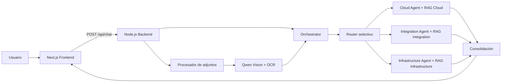

# Architecture Multi-Agent

Aplicación full stack para diseñar y validar arquitecturas de software utilizando un modelo multimodal local, recuperación aumentada por documentos (RAG) y especialistas independientes en Cloud, Integración e Infraestructura.

El sistema permite realizar consultas de arquitectura en español, adjuntar documentos de referencia y validar diagramas mediante visión artificial y OCR. El procesamiento se ejecuta localmente con Ollama y `qwen3-vl:4b`.

## Características principales

- Chat web desarrollado con Next.js y React.
- Backend HTTP en Node.js y TypeScript, sin framework web adicional.
- Modelo multimodal local mediante Ollama.
- Análisis de imágenes con Qwen Vision, OCR con Tesseract y preprocesamiento con Sharp.
- Tres fuentes RAG aisladas: Cloud, Integración e Infraestructura.
- Router selectivo que ejecuta únicamente los especialistas justificados por la consulta o el diagrama.
- Conversación guiada para aclarar términos ambiguos y recopilar requisitos antes de recomendar una solución.
- Validación determinista con estados `COMPLIANT`, `NON_COMPLIANT`, `NOT_EVIDENT` y `NOT_APPLICABLE`.
- Soporte para imágenes, PDF y archivos de texto.
- Historial corto de conversación y trazabilidad mediante `requestId`.
- Logs estructurados sin almacenar imágenes Base64, prompts completos ni secretos.

## Arquitectura



### Modos de operación

#### DESIGN

Se utiliza para consultas textuales sin una imagen de arquitectura. El router analiza la intención y selecciona uno, dos o tres especialistas.

Ejemplos:

| Consulta | Especialistas seleccionados |
| --- | --- |
| `api gateway` | Integración |
| `API REST desplegada en Kubernetes` | Integración + Infraestructura |
| `API crítica en AWS, Kubernetes y multi-AZ` | Cloud + Integración + Infraestructura |

Los especialistas seleccionados se ejecutan de forma secuencial y cada uno consulta únicamente su propio documento RAG.

### Conversación guiada

Una frase breve como `api gateway`, `Kubernetes` o `Kafka` no se interpreta automáticamente como una solicitud de diseño. El agente pregunta si el usuario necesita una definición, lineamientos, ayuda para crear una solución o validar una arquitectura existente.

Cuando el usuario desea diseñar o implementar un componente, el agente puede solicitar contexto sobre estilo arquitectónico, plataforma de despliegue, consumidores, protocolos, seguridad, tráfico y disponibilidad. Las respuestas breves posteriores conservan el tema de los últimos mensajes y evitan repetir preguntas ya respondidas.

#### VALIDATION

Se activa automáticamente al adjuntar una imagen. El flujo es:

1. La imagen se procesa una sola vez con el modelo visual y OCR.
2. Se genera evidencia estructurada: componentes, conexiones, despliegue, redes, APIs, mensajería, seguridad y observabilidad.
3. El router selecciona los dominios respaldados por esa evidencia.
4. Cada especialista compara la evidencia visible con sus reglas recuperadas.
5. El orquestador consolida findings, riesgos, recomendaciones, fuentes y preguntas de aclaración.

Una regla documental representa un requisito; nunca se considera evidencia de que el diagrama ya lo implementa.

### Criterios de validación

| Estado | Significado |
| --- | --- |
| `COMPLIANT` | Existe evidencia visual que confirma el cumplimiento. |
| `NON_COMPLIANT` | La evidencia visible contradice la regla. |
| `NOT_EVIDENT` | La regla aplica, pero el diagrama no permite comprobarla. |
| `NOT_APPLICABLE` | La regla no corresponde a los componentes observados. |

El estado general puede ser `COMPLIANT`, `PARTIAL_COMPLIANCE`, `NON_COMPLIANT` o `INCONCLUSIVE`.

## Estructura del repositorio

```text
AgenteIA/
├── backend/
│   ├── documents/                 # PDFs utilizados por cada RAG
│   │   ├── cloud/
│   │   ├── integration/
│   │   └── infrastructure/
│   ├── scripts/                   # Fixtures y pruebas E2E
│   ├── src/
│   │   ├── agents/
│   │   │   ├── cloud/
│   │   │   ├── integration/
│   │   │   ├── infrastructure/
│   │   │   ├── orchestrator/
│   │   │   └── shared/
│   │   ├── api/chat/              # Servidor y endpoint HTTP
│   │   ├── config/                # Entorno, constantes y logging
│   │   ├── ingestion/             # PDF, adjuntos, chunks y reglas
│   │   ├── llm/                   # Cliente y provider de Ollama
│   │   ├── models/                # Contratos del dominio
│   │   └── vision/                # Visión multimodal y OCR
│   └── tests/                     # Pruebas unitarias, integración y fixtures
├── frontend/
│   └── src/
│       ├── app/                    # App Router de Next.js
│       ├── components/             # Interfaz del chat
│       ├── hooks/                  # Estado y flujo de conversación
│       ├── services/               # Cliente HTTP
│       └── types/                  # Contratos TypeScript
├── .gitignore
└── README.md
```

## Requisitos

- Node.js 24 recomendado.
- npm 11 o compatible.
- Ollama instalado y accesible localmente.
- Aproximadamente 4 GB o más de memoria disponible para el modelo, dependiendo de la plataforma.

Versiones utilizadas durante la validación del proyecto:

```text
Node.js v24.18.1
npm 11.16.0
Ollama + qwen3-vl:4b
```

## Instalación

### 1. Clonar el repositorio

```bash
git clone <URL_DEL_REPOSITORIO>
cd AgenteIA
```

### 2. Preparar Ollama

Inicia Ollama y descarga el modelo:

```bash
ollama pull qwen3-vl:4b
```

Comprueba que esté disponible:

```bash
ollama list
```

### 3. Instalar dependencias

```bash
cd backend
npm install

cd ../frontend
npm install
```

En PowerShell con ejecución de scripts restringida puedes utilizar `npm.cmd` en lugar de `npm`.

### 4. Configurar variables de entorno

Backend:

```powershell
Copy-Item backend/.env.example backend/.env
```

Frontend:

```powershell
Copy-Item frontend/.env.example frontend/.env.local
```

No subas `.env` ni `.env.local` al repositorio.

## Variables de entorno

### Backend

| Variable | Valor predeterminado | Descripción |
| --- | --- | --- |
| `PORT` | `3001` | Puerto del servidor HTTP. |
| `OLLAMA_BASE_URL` | `http://localhost:11434` | URL de Ollama. |
| `OLLAMA_CHAT_MODEL` | `qwen3-vl:4b` | Modelo de texto y visión. |
| `MAX_ARCHITECTURE_IMAGE_MB` | `10` | Límite máximo procesado por adjunto en el backend. |
| `VALIDATION_TOP_K_PER_QUERY` | `5` | Reglas recuperadas por consulta RAG. |
| `VALIDATION_RULE_LIMIT` | `20` | Máximo de reglas evaluadas por especialista. |
| `ARCHITECTURE_VALIDATION_DEBUG` | `false` | Activa trazas detalladas de validación. |

### Frontend

| Variable | Valor predeterminado | Descripción |
| --- | --- | --- |
| `NEXT_PUBLIC_BACKEND_URL` | `http://localhost:3001/api/chat` | Endpoint completo consumido por el navegador. |

## Ejecución local

Abre dos terminales.

Terminal 1, backend:

```bash
cd backend
npm run dev
```

Terminal 2, frontend:

```bash
cd frontend
npm run dev
```

Servicios:

- Frontend: [http://localhost:3000](http://localhost:3000)
- Backend: `http://localhost:3001`
- Ollama: `http://localhost:11434`

El backend expone solamente `POST /api/chat`; abrir `http://localhost:3001` directamente devuelve `404` de forma esperada.

## API

### `POST /api/chat`

Solicitud mínima:

```json
{
  "message": "¿Qué lineamientos recomiendas para un API Gateway?"
}
```

Solicitud con historial y adjunto:

```json
{
  "message": "¿Este diagrama cumple los lineamientos?",
  "history": [
    { "sender": "user", "text": "Necesito validar una API crítica" },
    { "sender": "agent", "text": "Adjunta el diagrama de arquitectura." }
  ],
  "attachments": [
    {
      "name": "arquitectura.png",
      "type": "image/png",
      "content": "BASE64_SIN_EL_PREFIJO_DATA_URL"
    }
  ]
}
```

Respuesta exitosa:

```json
{
  "response": "Recomendación o validación consolidada"
}
```

Respuesta de error:

```json
{
  "error": "Descripción del error",
  "requestId": "a1b2c3d4"
}
```

### Adjuntos admitidos

| Categoría | Formatos |
| --- | --- |
| Imagen | PNG, JPEG y WebP |
| Documento | PDF |
| Texto | TXT, Markdown, CSV, JSON y XML |

Restricciones de la interfaz:

- Máximo tres archivos por consulta.
- Máximo una imagen por consulta.
- Imágenes de hasta 10 MB.
- Documentos de hasta 5 MB desde el frontend.
- El cuerpo HTTP completo no puede superar 16 MB.
- Se conservan como máximo 30 000 caracteres extraídos por documento.
- Los PDF escaneados o protegidos pueden no contener texto extraíble.

## Documentos RAG

Cada especialista utiliza exclusivamente su documento:

- `backend/documents/cloud/Cloud_Architecture_Guidelines_RAG.pdf`
- `backend/documents/integration/Integration_Architecture_Guidelines_RAG.pdf`
- `backend/documents/infrastructure/Infrastructure_Architecture_Guidelines_RAG.pdf`

Después de reemplazar un PDF, verifica la ingesta:

```bash
cd backend
npm run ingest
```

## Calidad y pruebas

Backend:

```bash
cd backend
npm run build
npm test
npm run ingest
npm run fixtures
npm run test:e2e
```

Frontend:

```bash
cd frontend
npm run lint
npm run build
```

`npm run test:e2e` necesita el backend, Ollama y el modelo en ejecución. Sus resultados se generan en `backend/tests/e2e-results/` y no se versionan.

## Logs y trazabilidad

En ejecución se crean automáticamente:

```text
logs/application.log
logs/error.log
```

Entre otros datos seguros, los logs incluyen:

- `requestId` de cada solicitud.
- modo `DESIGN` o `VALIDATION`.
- metadata y tamaño de adjuntos.
- duración del análisis visual.
- especialistas seleccionados y descartados.
- puntuación y motivos del router.
- `ruleId` y estados encontrados.
- duración total y errores completos.

Los logs y archivos de ejecución están excluidos de Git.

## Solución de problemas

### `ERR_CONNECTION_REFUSED`

Comprueba que cada servicio esté escuchando:

```powershell
netstat -ano | Select-String ':3000|:3001|:11434'
```

### El backend devuelve `404`

Es normal al abrir la raíz del puerto `3001`. Utiliza el frontend o envía un `POST` a `/api/chat`.

### Ollama o el modelo no están disponibles

```bash
ollama serve
ollama pull qwen3-vl:4b
ollama list
```

Comprueba también que `OLLAMA_BASE_URL` y `OLLAMA_CHAT_MODEL` coincidan con la instalación local.

### El análisis de una imagen tarda más que una consulta de texto

Las imágenes requieren inferencia multimodal y OCR. El tiempo depende principalmente de CPU, GPU, memoria disponible, resolución del archivo y tamaño del modelo.

### PowerShell bloquea `npm.ps1`

Ejecuta el wrapper de Windows:

```powershell
npm.cmd install
npm.cmd run dev
```

### Consultar la causa de un error

Busca el `requestId` mostrado por el frontend dentro de `logs/application.log` y `logs/error.log`.

## Consideraciones para producción

Esta implementación es una prueba de concepto local. Antes de publicarla como servicio productivo se recomienda agregar autenticación, autorización, rate limiting, almacenamiento externo de logs, HTTPS, límites por usuario, análisis de malware en adjuntos y una política explícita de retención de datos.
